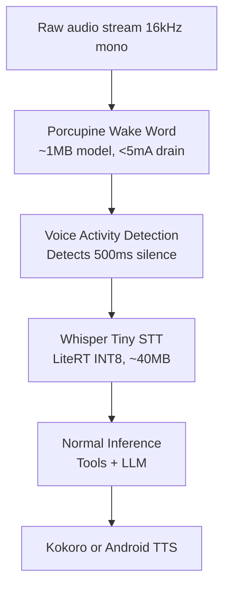

# 08  Voice Interface and Settings

## Wake Word & Voice Pipeline

The voice interface provides an always-on, zero-cloud pipeline executing strictly within the background foreground service on Android.

### Pipeline Overview

### Battery Optimization strategy
- **Porcupine**: High-efficiency audio listener using ~3-5 mA (equivalent to a pedometer).
- **Whisper**: ~500ms bursts using higher power only when transcribing.
- **VAD**: Avoids continuous Whisper transcriptions by utilizing an energy-based (RMS > 0.02) simple detector. Failsafe timeout at 30 seconds.

## System Settings (LLM-Controlled)

Every setting is exposed to the LLM via `settings_read` and `settings_write` tools. The user can toggle UI and behavior natively via voice or chat.

### Settings Registry (Excerpt)

| Key | Type | Default | Options | LLM Writable |
| :--- | :--- | :--- | :--- | :--- |
| `theme.mode` | enum | dark | dark / light / system | Yes |
| `model.maxTokens` | int | 2048 | 512 - 8192 | Yes |
| `agent.memoryEnabled` | bool | true | true / false | Yes |
| `trigger.mailPollMinutes` | int | 15 | 5 - 120 | Yes |
| `automation.miniKairosEnabled` | bool | true | true / false | Yes |
| `voice.ttsEngine` | enum | android | android / kokoro | Yes |
| `privacy.biometricLock` | bool | false | true / false | **NO** (Security) |
| `privacy.analyticsEnabled` | bool | false | true / false | **NO** |
